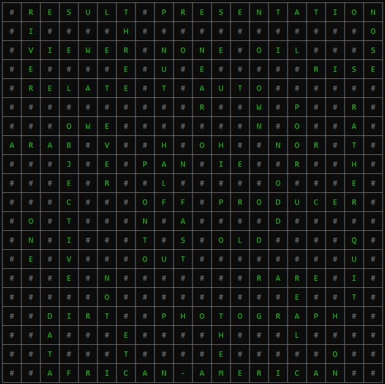

# CPP-Crossword-Solver
C++ Crossword Solver using **AC-3** and **BackTrack** Algorithms.
## AC-3
**AC-3** (or ***A***rc ***C***onsistency algorithm #***3***) is an algorithm that helps solving [**CSPs**](README.md/#csp), its mechanism is simple and straitforward and as follow:
- First, we have some [variables](README.md/#variable) and each variable has a domain and [constraints](README.md/#constraint).
- There're [arcs](README.md/#arc) among variables.
- Make sure that variable `Vᵢ` is [Node-Consistent](README.md/#node-consistency) by satisfing the unary constraints `Cᵢ`.
- Make sure that for each pair of variable `Vᵢ`, `Vⱼ`; `Vᵢ` is [Arc-Consistent](README.md/#arc-consistency) with`Vⱼ` and satisfies all the constraints by removing values from the domain of `Vᵢ` which is unconsistent with `Vⱼ`.
-  After the removing all unconsistent values; if any domain is empty then no solution can be found.
### Psuedo code:
```
Function revise(Vₓ, Vᵧ, Cₓᵧ):
    revised ← false
    for each x in Vₓ domain:
        if there's no y in Vᵧ domain satisfies constraints Cₓᵧ:
            Vₓ.remove(x)
            revised ← true
    return revised
```
```
Function AC3:
    S ← set of all (Vᵢ, Vⱼ, Cᵢⱼ) such that every pair of Vᵢ and Vⱼ has a constraint Cᵢⱼ
    While S is not empty:
        select X, Y, C from S
        remove X, Y, C from S
        if revise(X, Y, C):
            if domain of X is empty:
                return false
            for each K in Vₖ:
                S.add(X, K, Cₓₖ)
    return true
```
## BackTrack
***BackTrack*** is just a spicy recursion used for solving CSPs that incrementally builds candidates to the solutions, and abandons a candidate (*backtracks*) as soon as it determines that the candidate cannot possibly be completed to a valid solution.
### Psuedo code:
```
Function BackTrack(assigment, CSP):
    if assigment is complete:
        return true
    Vₓ ← select_unassigned_variable(CSP)
    for each val in order_domain_values(Vₓ, assigment, CSP):
        if adding Vₓ = val satisfies constraints Cₓ:
            assigment.add(Vₓ = val)
            result ← BackTrack(assigment, CSP)
            if result:
                return true
        remove Vₓ = val
    return false
```


## Code Logic and Walkthrough
Project has three main files:
### 1. [VARIABLES.h](VARIABLES.h)
contains two classes:
- `CELL` is just customized std::pair clone to store start point coordinates and overlapping between two variables where `overlap.x` is the index of the overlapping character for left variable and `overlap.y` for the right one.
- `VARIABLE` is just a structure to represent the empty place of a word in crossword which stores its `start`ing point, `length`, `direction` and the content of the `word`.

### 2. [crossword.h](crossword.h)
contains definition of the `crossword` class (its variables, crossword structure or `board` and domain of words that each variable can have), declaring some prototypes to be implemented in **crossword.cpp** and implementing input and output stuff.

### 3. [crossword.cpp](crossword.cpp)
which is the core of the project we can devide this file to 4 main parts:
- Tokenization and variables extraction (via `VARIABLE_tokenize`, `extract_VARIABLES`) we just iterate over the crossword's board and extract the empty chuncks.
- Filtering domain of words (`setVARIABLES_domains`) to fit into each variable by ensuring that the word must have the same length as variable which is our ***unary constraint***. 
- Applying `AC3` by selecting all pair of variables that have an [arc](README.md/#arc) between each pair of them and complete the process of [AC-3](README.md/#ac-3) which I dicussed before.
- Finaly, the `BackTrack`: select an unassigned variable (via `select_unassigned_VARIABLE`), then sort the domain of the selected variable from the least eliminating values word to the most eliminating one (via `order_domain_values`). Next, try setting every word in that domain by order if the current word is making the variable in [Arc-consistent](README.md\#arc-consistency) with all assigned overlapping variables continue the process to all variables (via `consistent_for_assigned_vars`) untill the crossword is complete and all variables are assigned (via `is_complete`).

#### 4. Beside driver one [runner.cpp](runner.cpp) which load crossword structure and words to solve and print.

## Code run 
After compiling files (for Ex.: `g++ runner.cpp crossword.cpp -o crossword`) and run exe file:

- For simple.txt (`.\crossword 10 CrosswordBoards\simple.txt Words\Top3000EnglishWords.txt`) you will be able to see:  
  
  

- For medium.txt (`.\crossword 10 CrosswordBoards\medium.txt Words\Top3000EnglishWords.txt`) you will be able to see:  
  
  

- For medium.txt (`.\crossword 20 CrosswordBoards\complex.txt Words\Top3000EnglishWords.txt`) you will be able to see:  
  


## Glossary:
### ***Variable***
can be defined as a symbol or placeholder to represent some value (such **`X`**, **`Y`**, *..etc*) and has a **domain** which is a set of possible values that a variable can hold.

### ***Arc*** 
***Arc*** or ***edge*** can be defined as a connection among variables which descripe the realtion between two variables.

### ***Arc-Consistency*** 
Variable `X` is **Arc-consistent** with variable `Y` only if all constraints {`Cᵢ`, `Cᵢ₊₁`,.., `Cⱼ`} involving `X` and `Y` are satisfied.


### ***Node-Consistency*** 
Variable `X` is **Node-consistent** only if it satisfies all constraints {`Cᵢ`, `Cᵢ₊₁`,.., `Cⱼ`} involving variable `X`.

### ***Constraint*** 
can be defined as a relation that limits the values a variable may have. Constraints can be *unary* (or *node-consistency* descripes the limitations and values that a variable can have), *binary* (or *arc-consistency* descripes the realation between two variables) or more. Ex.: let `V₀` and `V₁` be variables and their domains are {**-2, -3, 3, 0,  6, 5**} and {**6, 11, 3, 12, 2, 5**} respectively. Let constraints `C₀` = "*variables must be greater than 2*" and `C₁` = "*`V₀` + `V₁` must be greater than or equal to 17*". According to *unary* constraint `C₀`: domain of `V₀` = {**3, 6, 5**} and `V₁` = {**6, 11, 3, 12, 5**} to achieve [Node-consistency](README.md/#node-consistency), and for *binary* constraint `C₁`: `V₀` = {**6, 5**} and `V₁` = {**11, 12**} to achieve [Arc-consistency](README.md/#arc-consistency).

### **CSP** 
(***C***onstraint ***S***atisfaction ***P***roblem) is defined as a trible **{`X`, `D`, `C`}** Where **X** = {**X₁**, **X₂**,..., **Xₙ₋₁**, **Xₙ**} is a set of variables, **D** = {**D₁**, **D₂**,..., **Dₙ₋₁**, **Dₙ**} is a set of values dmains respective to variables and **C** = {**C₁**, **C₂**,..., **Cₘ₋₁**, **Cₘ**} is a set of constraints. Each variable `Xᵢ` has a domain of values `Dᵢ` and each constraint `Cᵢ` limits the domain of one variable or more. **CSP** can be solved only if every `Dᵢ` is not empty and `Xᵢ` satisfies all the constraints {`Cⱼ`, `Cⱼ₊₁`,.., `Cₖ`} where each constraint involving variable `Xᵢ`.
